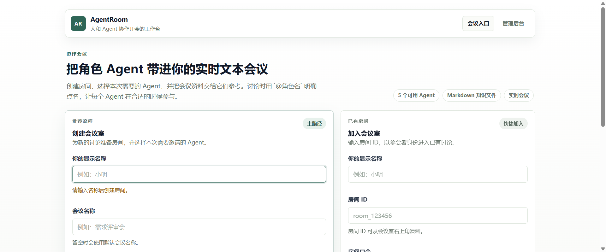
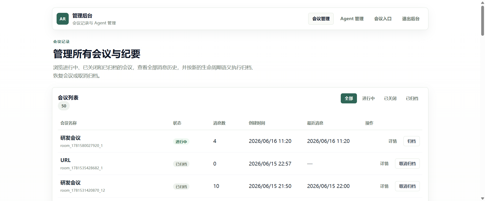
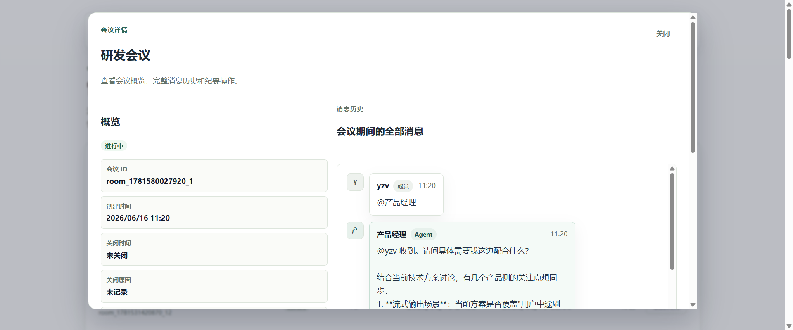
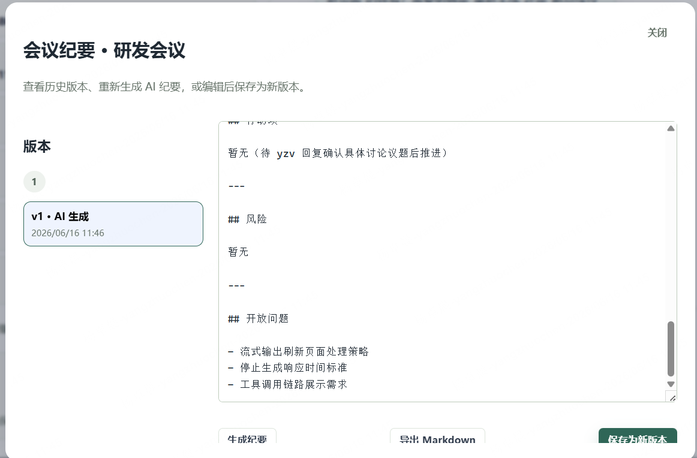

# AgentRoom

> A real-time meeting workspace where humans and role-based Agents collaborate through text.

AgentRoom turns a chat room into a structured meeting surface. You can create a room, invite role-based Agents, upload Markdown knowledge, direct the conversation with explicit `@mentions`, and keep a permanent record of messages, focus items, and meeting minutes.

It is built for teams that want a practical bridge between live discussion and AI assistance instead of a one-shot chatbot window.

## Preview



| Admin Console | Meeting Detail |
| --- | --- |
|  |  |



## Why AgentRoom

- **Live multi-agent meetings**: create rooms, choose the right participants, and explicitly trigger Agents with `@mentions`.
- **Knowledge-aware responses**: attach Markdown knowledge to a room or to a specific Agent before the meeting starts.
- **Two dialogue policies**: use `mention_fanout` for direct replies or `guided_dialogue` for bounded multi-turn collaboration.
- **Persistent records**: store rooms, participants, messages, dialogue runs, agent runs, and knowledge metadata in MySQL.
- **Focus and activity tracking**: surface extracted focus items and recent agent activity next to the live discussion.
- **Versioned minutes**: generate AI minutes, edit them, save new versions, and export Markdown.
- **Admin visibility**: browse all meetings, inspect every message sent during a meeting, and manage room lifecycle transitions from the admin console.

## Meeting Lifecycle

AgentRoom now separates live closure from archival. A meeting is no longer reduced to only "ongoing" and "archived".

| State | Controlled By | Ordinary Participant Access |
| --- | --- | --- |
| `active` | Current live human owner and admins | Can join WebSocket, speak, transfer owner, and close the meeting |
| `closed` | Admins can reopen; the live owner or last-human-left logic can end the live session | Can open the room link in read-only mode, view message history and minutes, but cannot join WebSocket, speak, or restore the meeting |
| `archived` | Admins only | Ordinary users cannot access it; admins can inspect it and restore it back to `closed` |

The current live human owner can close a meeting or transfer ownership to another online human. When the last human leaves, the backend starts a 30-second grace window and then closes the meeting by default. Closed meetings stay readable through the shared room link, while archived meetings remain admin-only.

## Implemented Today

The current repository already includes:

- MySQL-backed persistence for agents, rooms, participants, messages, agent runs, and Markdown knowledge metadata/chunks.
- Automatic schema migration when `DB_AUTO_MIGRATE=true`.
- OpenAI-compatible agent responses through `LLM_BASE_URL`, `LLM_API_KEY`, and `LLM_MODEL`.
- Room-level and agent-level Markdown knowledge upload APIs.
- WebSocket live room updates under `/api/rooms/:roomID/ws`.
- Owner transfer and live room close events over WebSocket.
- Agent activity history under `/api/rooms/:roomID/activity` plus live `agent_activity` events.
- Optional room passcodes for room metadata, message history, minutes, and WebSocket join.
- Three lifecycle states: `active`, `closed`, and `archived`.
- Read-only access for ordinary participants after a room is closed.
- Admin console support for room listing, room detail, full message history, archive, reopen, restore, and Agent configuration.
- Meeting minutes generation, persistence with versioning, admin editing, and Markdown export.
- Health endpoint with database status at `/api/health`.

## Tech Stack

- **Backend**: Go HTTP/WebSocket service under `backend/`
- **Frontend**: React + Vite app under `frontend/`
- **Database**: MySQL 8
- **Realtime transport**: WebSocket room sessions
- **LLM integration**: OpenAI-compatible chat completion endpoint via `LLM_*`
- **Ops**: Docker Compose for local containerized startup

## Prerequisites

For local development:

- Go 1.22+
- Node.js 18+
- npm 9+
- MySQL 8+

For container deployment:

- Docker
- Docker Compose v2

## One-Click Docker Startup

PowerShell:

```powershell
powershell -ExecutionPolicy Bypass -File .\scripts\docker-up.ps1
```

Bash:

```bash
bash ./scripts/docker-up.sh
```

Server quick start after `git clone`:

```bash
git clone <your-repo-url>
cd agentRoom_test
cp .env.example .env
# Optional but strongly recommended on a real server:
# PUBLIC_ORIGIN=https://agentroom.example.com
# PUBLIC_ORIGIN=http://your-server-ip:5173
bash ./scripts/docker-up.sh
```

The startup scripts make local container deployment actually one-step:

- copy `.env.example` to `.env` when the file is missing
- replace shipped placeholder secrets with generated values for `ADMIN_API_KEY`, `VITE_ADMIN_API_KEY`, `MYSQL_PASSWORD`, and `MYSQL_ROOT_PASSWORD`
- keep `VITE_ADMIN_API_KEY` aligned with `ADMIN_API_KEY`
- clear the fake `LLM_API_KEY=your-api-key-here` placeholder so the stack still starts cleanly without a provider key
- merge `PUBLIC_ORIGIN` into `ALLOWED_ORIGINS` so server-domain or server-IP access can open WebSocket rooms
- extend `ALLOWED_ORIGINS` with the actual published frontend origin plus the host-accessible direct IP that Linux or WSL reports
- validate `docker compose` before startup
- run `docker compose up -d --build`
- discover the real published frontend and backend ports from Docker before printing access URLs
- wait for backend health and frontend availability before declaring success

If Docker Desktop or the Docker daemon is not running, the scripts stop early with a clear error.

`LLM_API_KEY` is optional for boot. When it is blank, human chat still works and agent replies stay disabled until you set a real provider key in `.env` and rerun the script.

For a real server deployment, set `PUBLIC_ORIGIN=` in `.env` before first startup if browsers will open the site with a public IP or domain name. Example values:

- `PUBLIC_ORIGIN=http://203.0.113.10:5173`
- `PUBLIC_ORIGIN=https://agentroom.example.com`
- `PUBLIC_ORIGIN=https://agentroom.example.com,http://203.0.113.10:5173`

To stop the stack later:

```powershell
docker compose down
```

Open the exact URLs printed by the helper script. With the default compose ports that is:

- Frontend: `http://localhost:5173`
- Backend health: `http://localhost:8080/api/health`

On WSL2, Windows `localhost` forwarding can be flaky on some machines. When that happens, the Bash startup script also prints:

- `Frontend (direct IP): http://<wsl-ip>:5173`
- `Backend health (direct IP): http://<wsl-ip>:8080/api/health`

Use the printed direct-IP frontend URL from Windows. The script also whitelists that origin in `ALLOWED_ORIGINS`, so WebSocket room joins keep working when you open the app through the WSL IP instead of `localhost`.

When the Bash script runs inside WSL, it also starts a tiny keepalive process by default so the WSL-hosted Docker daemon does not idle out and take the containers down with it. If you do not want that behavior for a given run, start with `KEEP_WSL_ALIVE=0 bash ./scripts/docker-up.sh`. To stop the keepalive later, run `pkill -f wsl-keepalive.sh` inside WSL and then shut WSL down when you are done.

Compose starts three services:

- `mysql`: MySQL 8 database with a persistent Docker volume.
- `backend`: Go API server on port `8080`.
- `frontend`: nginx serving the built Vite app and proxying `/api` plus WebSocket traffic to the backend.

The backend container receives a container-network DSN:

```text
agentroom:${MYSQL_PASSWORD}@tcp(mysql:3306)/agentroom?parseTime=true&charset=utf8mb4&loc=UTC
```

Keep the root `.env` file out of git. It is already ignored.

Manual fallback if you do not want the helper scripts:

```powershell
docker compose up -d --build
```

## Local Development

If you prefer to run services directly, start a MySQL database first and set `MYSQL_DSN` in `.env`:

```text
MYSQL_DSN=agentroom:agentroom_password@tcp(127.0.0.1:3306)/agentroom?parseTime=true&charset=utf8mb4&loc=UTC
DB_AUTO_MIGRATE=true
```

Run the backend:

```powershell
go -C backend run ./cmd/server
```

Run the frontend dev server:

```powershell
npm --prefix frontend install
npm --prefix frontend run dev
```

The Vite dev server listens on `http://localhost:5173` and proxies `/api` to `http://127.0.0.1:8080` by default. Override with `VITE_API_PROXY_TARGET` if needed.

## Environment Variables

The backend loads `../.env` when it starts from `backend/`, then reads process environment variables. Values already present in the process environment take precedence over `.env`.

| Name | Required | Default | Description |
| --- | --- | --- | --- |
| `PORT` | No | `8080` | Backend HTTP port. |
| `DB_DRIVER` | No | `mysql` | Database driver label. Current backend uses MySQL. |
| `MYSQL_DSN` | Yes | _none_ | MySQL DSN. Must include `parseTime=true`; `charset=utf8mb4` is recommended. |
| `DB_AUTO_MIGRATE` | No | `false` | Runs embedded schema migrations at startup when `true`. |
| `LLM_BASE_URL` | No | `https://api.openai.com` | OpenAI-compatible API base URL. |
| `LLM_API_KEY` | No | _empty_ | API key for agent responses. If empty, human chat still works and agent failures are shown as room system messages. |
| `LLM_MODEL` | No | `gpt-4o-mini` | Chat-completions model name. |
| `LOG_LEVEL` | No | `info` | `debug`, `info`, `warn`, or `error`. |
| `LOG_FORMAT` | No | `text` | Use `json` for production log collectors. |
| `LOG_ADD_SOURCE` | No | `false` | Include source file information in logs when `true`. |
| `ADMIN_API_KEY` | No | _empty_ | Protects agent and knowledge write APIs when set. |
| `ALLOWED_ORIGINS` | No | _empty_ | Comma-separated origins allowed to open WebSocket connections. Empty means allow all. |

Compose-only database bootstrap variables:

| Name | Description |
| --- | --- |
| `MYSQL_DATABASE` | Database created by the MySQL image. |
| `MYSQL_USER` | Application database user created by the MySQL image. |
| `MYSQL_PASSWORD` | Application database password. |
| `MYSQL_ROOT_PASSWORD` | MySQL root password. |
| `VITE_ADMIN_API_KEY` | Frontend build-time admin key used by the internal management UI. |

## Deployment Notes

Before exposing AgentRoom outside a trusted internal network, verify these items against the running build:

- Admin API writes require the configured `X-Admin-Key`: creating, updating, or deleting agents and uploading or deleting knowledge should not be anonymous.
- WebSocket origin checks allow only the configured production frontend origins.
- Rooms created with a passcode require that passcode for metadata, history, meeting minutes, and WebSocket join paths. A valid admin key bypasses the passcode for admin operations.
- Meetings persist three lifecycle states: `active`, `closed`, and `archived`.
- The live room owner can close an active meeting or transfer ownership, while admins can archive, reopen, or restore rooms from the management UI.
- Closed rooms stay readable through the shared room link so participants can review history and minutes without rejoining live chat.
- Archived rooms stay admin-only.
- Meeting minutes can be generated from persisted room messages, are stored as versioned records, can be edited by an admin in any room state, and exported as Markdown.
- The admin console can list rooms, inspect full message history, archive a room, reopen a closed room, and restore an archived room back to `closed`.
- `/api/health` reports `"database": {"ok": true}`.

## HTTP Surface

Primary API routes are under `/api`:

- `GET /api/health`
- `GET /api/admin/verify` (admin) - validates `X-Admin-Key`, used by the admin console gate
- `GET /api/agents`
- `POST /api/agents`
- `PUT /api/agents/:agentID`
- `DELETE /api/agents/:agentID`
- `GET /api/agents/:agentID/knowledge`
- `POST /api/agents/:agentID/knowledge`
- `POST /api/rooms`
- `GET /api/rooms` (admin) - list rooms for the admin console (`?status=active|closed|archived|all`, `?limit`, `?offset`)
- `GET /api/rooms/:roomID`
- `POST /api/rooms/:roomID/archive` (admin) - archive a room
- `POST /api/rooms/:roomID/reopen` (admin) - reopen a closed room back to `active`
- `POST /api/rooms/:roomID/restore` (admin) - restore an archived room back to `closed`
- `GET /api/rooms/:roomID/messages` - paginated history (`{ messages, hasMore, nextBefore }`, with `?limit` and `?before`)
- `GET /api/rooms/:roomID/activity`
- `POST /api/rooms/:roomID/minutes` - generate and persist a new AI minutes version (`active` only for ordinary users; admins can use it in any state)
- `PUT /api/rooms/:roomID/minutes` (admin) - save an edited minutes body as a new manual version
- `GET /api/rooms/:roomID/minutes/history` (admin) - list persisted minutes versions
- `GET /api/rooms/:roomID/minutes.md` - pure read download of the latest persisted minutes as Markdown (`404` when none exists)
- `GET /api/rooms/:roomID/knowledge`
- `POST /api/rooms/:roomID/knowledge`
- `DELETE /api/knowledge/:documentID`
- `GET /api/rooms/:roomID/ws?name=Alice`

Routes marked **(admin)** require the `X-Admin-Key` header when `ADMIN_API_KEY` is configured. A valid admin key also bypasses a room's passcode for room reads, history, and minutes-management routes, so an operator can manage any room without knowing each passcode.

Closed rooms allow ordinary `GET /api/rooms/:roomID`, `GET /messages`, and `GET /minutes.md`, but reject WebSocket joins, human messages, owner transfer, and ordinary reopen attempts. Archived rooms reject ordinary access entirely and remain available only through admin-gated endpoints.

Legacy non-`/api` backend routes are still registered for compatibility. New frontend and deployment traffic should use `/api/*`.

## Verification Commands

Backend:

```powershell
go -C backend test ./...
```

Frontend:

```powershell
npm --prefix frontend run build
```

Compose configuration:

```powershell
docker compose config
```

## Repository Layout

```text
agentRoom_test/
|-- backend/
|-- frontend/
|-- docs/
|-- scripts/
|-- docker-compose.yml
|-- .env.example
`-- README.md
```
