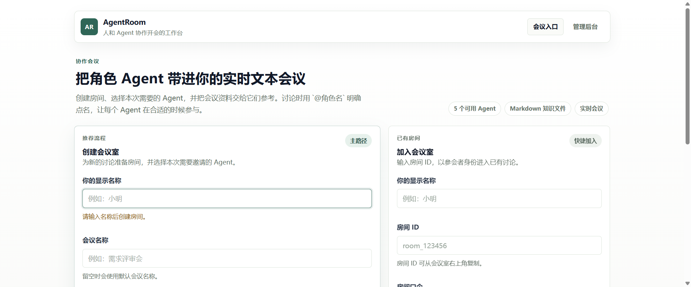
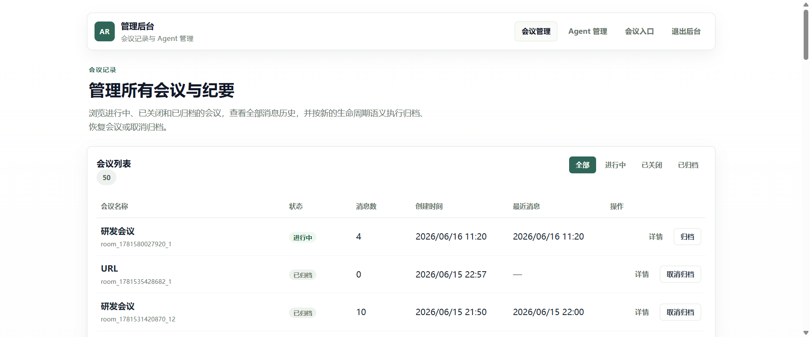
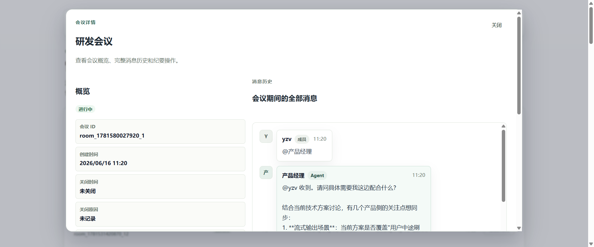
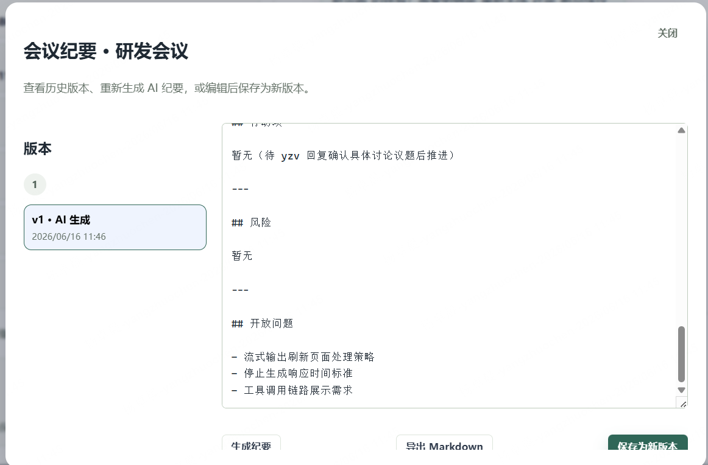

# AgentRoom 🏠

> 一个实时多人会议室工作区——人类和 AI Agent 在同一房间内协作，Agent 默认倾听，只在被 @ 提及时响应。

[](https://go.dev)
[](https://react.dev)
[](https://python.org)
[](https://mysql.com)
[](#license)

---

## 预览



| 管理控制台 | 会议室详情 |
|-----------|-----------|
|  |  |



---

## 这是什么？

AgentRoom 是一个**实时 AI 协作会议平台**。你可以：

- 创建会议室，邀请多个角色化 AI Agent 参与
- 上传 Markdown 知识文档，让 Agent 的回答有上下文
- 使用 @AgentName 精确触发 Agent，或使用引导式对话进行多轮协作
- 自动生成会议纪要、追踪关注事项、导出历史记录

它不同于一个人机对话窗口——AgentRoom 是一个多人 + 多 Agent 的实时协作空间。

---

## 核心功能

- **多 Agent 实时会议** — 创建房间，选择 Agent，用 @ 提及触发回复
- **知识增强响应** — 房间级和 Agent 级知识库，Agent 回复附带来源引用
- **角色模板与角色组** — 预设角色模板，快速创建 Agent 集合
- **两种对话策略** — mention_fanout 直接回复 或 guided_dialogue 有限多轮协作
- **会议生命周期管理** — `active` → `closed`(可读不可写) → `archived`(管理员仅见)
- **版本化会议纪要** — 自动生成、手动编辑、版本管理、Markdown 导出
- **管理控制台** — 浏览所有会议、查看完整消息历史、管理生命周期
- **模型 Profile 管理** — 加密存储 API Key，支持 Go 和 Python 运行时分别配置
- **协作运行时引擎** — 支持 Native 和 AutoGen 两种多 Agent 协作引擎[详情](docs/architecture/collaboration-runtime-baseline.md)

---

## 快速开始

```bash
git clone <your-repo-url>
cd agentRoom_test
cp .env.example .env
bash ./scripts/docker-up.sh
```

启动脚本会自动生成安全密钥、初始化数据库，然后启动四个服务：

- **frontend** — 浏览器访问 http://localhost:5173
- **backend** — Go 控制面，端口 8080
- **agent-runtime** — Python gRPC 执行引擎（内部服务）
- **mysql** — 数据库

> 详细部署指引（WSL、端口修改、加密密钥、生产部署等）见 [docs/deployment/](./docs/deployment/)

---

## 技术栈

| 层 | 技术 |
|---|---|
| 后端 | Go 1.22+ / Gin / gorilla/websocket |
| 前端 | React 18 / Vite / Mantine |
| 数据库 | MySQL 8 |
| Agent 执行 | Python 3.12 + gRPC（独立容器） |
| LLM 集成 | OpenAI-compatible 模型 Profile |
| 部署 | Docker Compose |

---

## 项目结构

```
agentRoom_test/
├── backend/          # Go 控制面（HTTP/WS、房间编排、持久化）
├── frontend/         # React 前端
├── deepagent/        # Python Agent 运行时（gRPC 服务）
├── docs/             # 架构、部署、开发文档
├── scripts/          # Docker 启动辅助脚本
├── openspec/         # 规格与变更工件
├── docker-compose.yml
└── .env.example
```

---

## 文档索引

| 文档 | 适用场景 |
|---|---|
| [部署指南](./docs/deployment/) | 生产部署、Docker 详解、WSL、加密密钥 |
| [开发指南](./docs/development/) | 本地开发、测试命令、代码规范 |
| [API 参考](./docs/api/) | 完整 HTTP 路由表 |
| [架构文档](./docs/architecture/) | 后端分层、Agent 运行时、会议生命周期 |
| [运维指南](./docs/operations/) | 灰度发布、回滚、迁移注意事项 |

---

## License

MIT
