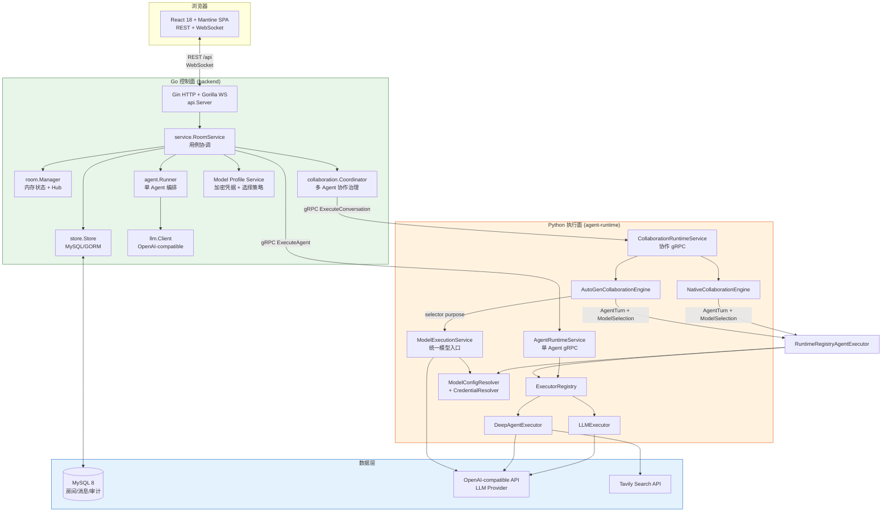
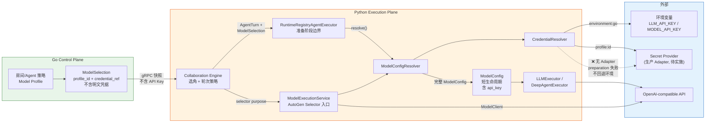
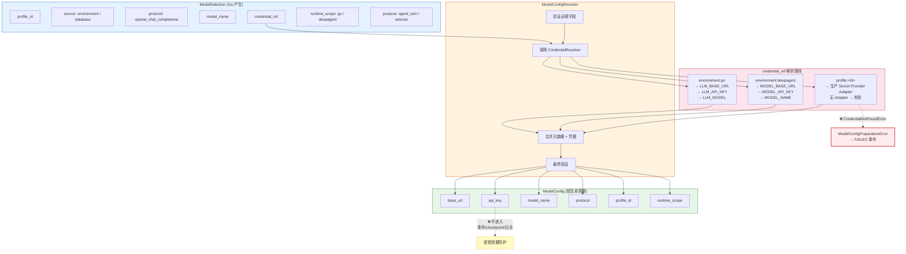
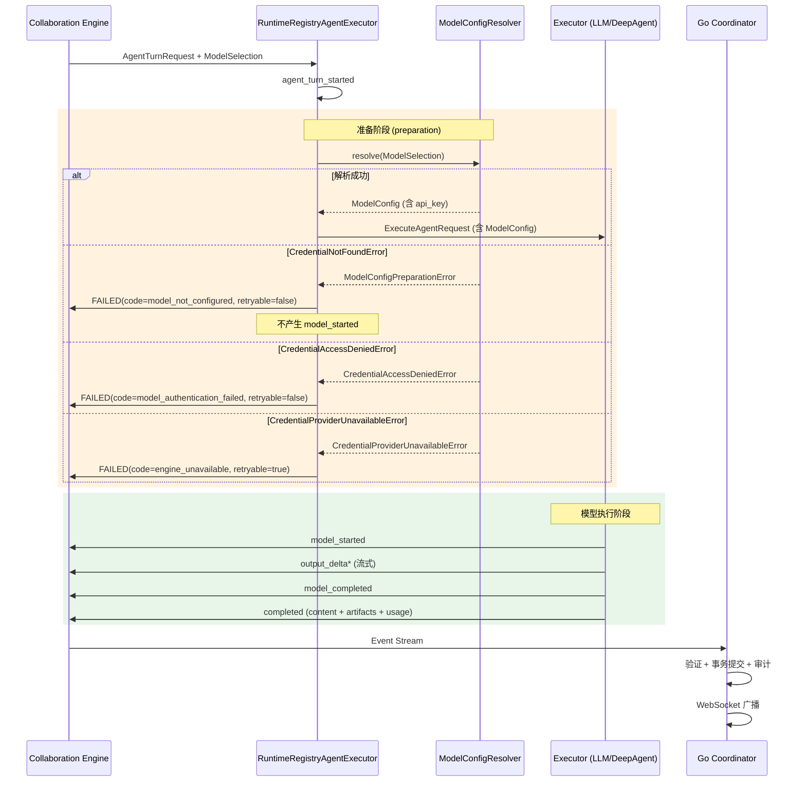
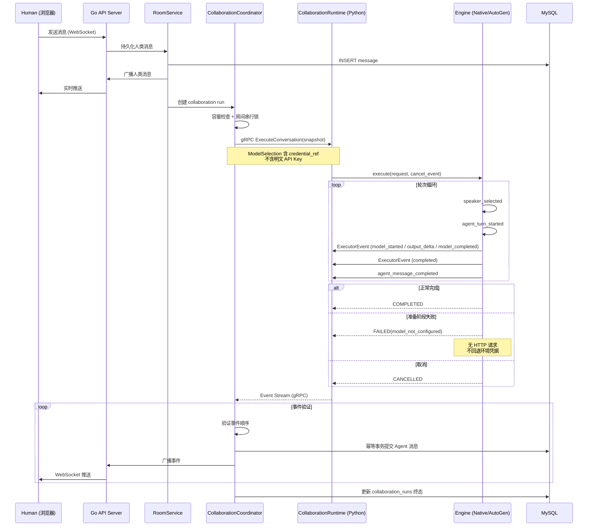
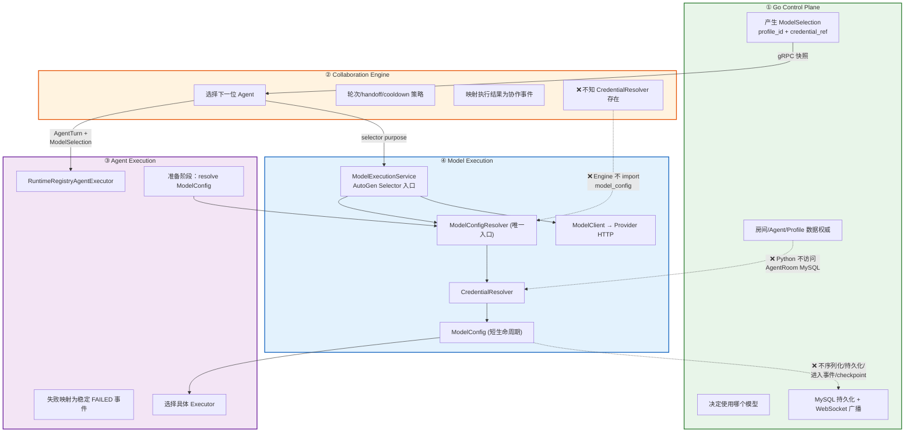
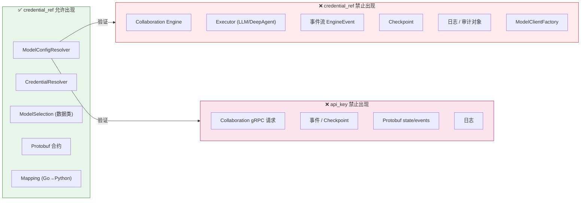
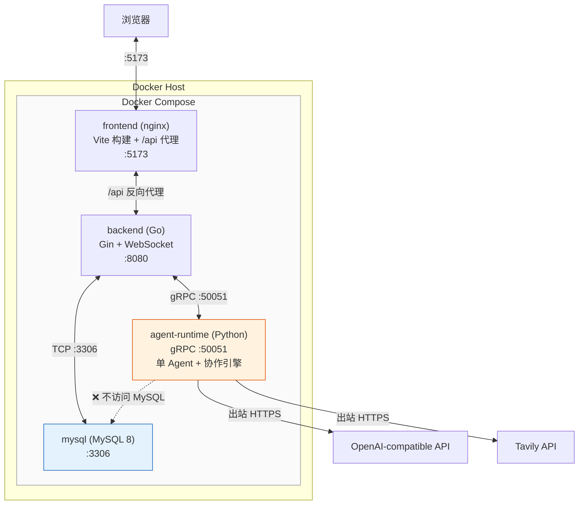

# AgentRoom 架构图

> 本文档使用 Mermaid 图表描述 AgentRoom 当前架构。所有图表反映 ADR-001 统一模型执行边界实施后的状态。

## 1. 系统总览

## 2. 统一模型执行边界（ADR-001 核心数据流）

## 3. 模型配置解析与凭据引用映射

## 4. 准备阶段事件顺序（时序图）

## 5. 协作运行时 gRPC 流程

## 6. 四层职责边界（ADR-001）

## 7. 凭据安全边界

## 8. Docker Compose 部署拓扑

---

## 图表索引

| 编号 | 名称 | 用途 |
| --- | --- | --- |
| 1 | 系统总览 | 快速了解整体组件和数据流方向 |
| 2 | 统一模型执行边界 | ADR-001 核心数据流，理解四层边界 |
| 3 | 模型配置解析 | credential_ref 映射路径和 ModelConfig 生成 |
| 4 | 准备阶段事件顺序 | 时序图，理解 preparation 失败如何映射 |
| 5 | 协作运行时 gRPC 流程 | 完整协作 run 从人类消息到事件提交 |
| 6 | 四层职责边界 | ADR-001 的职责分层和禁止项 |
| 7 | 凭据安全边界 | credential_ref 和 api_key 的允许/禁止位置 |
| 8 | Docker Compose 拓扑 | 部署视图，理解服务间网络关系 |

## 相关文档

- [ADR-001](decisions/ADR-001-control-collaboration-agent-model-execution-boundaries.md) — 统一模型执行边界决策
- [Agent Runtime 与模型](agent-runtime-and-models.md) — §9A 统一模型执行边界
- [架构索引](README.md) — 完整文档地图
